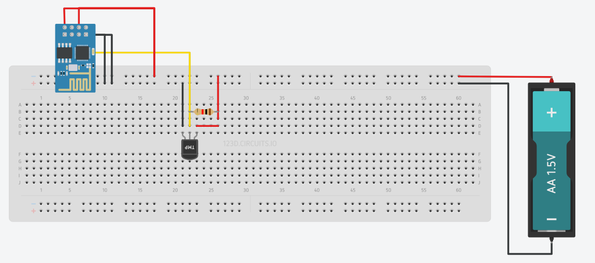

# DeepSleepDS18B20

Proyecto registrador de temperatura ESP8266

### Requerimientos:

 * [IDE de Arduino](https://www.arduino.cc/en/Main/Software).
 * [WiFiManager](https://github.com/tzapu/WiFiManager).
 * [ArduinoJson](https://github.com/bblanchon/ArduinoJson).
 * [RemoteDebug](https://github.com/JoaoLopesF/ESP8266-RemoteDebug-Telnet).
 * [OneWire](https://github.com/PaulStoffregen/OneWire).
 * [DallasTemperature](Arduino-Temperature-Control-Library).
 * Crear el circuito:
   * 
 * Telnet para el reporte de mensajes
   * Para activar telnet en Windows presiona las teclas *WIN+R* y ejecuta el siguiente comando:
      ```
      pkgmgr /iu:TelnetClient
      ```
   * Reiniciar.
   * Una vez conectada la placa esp8266 a una red wifi utilizar telnet para visualizar los mensajes en consola, por ejemplo:
      ```
        telnet 192.168.0.101
      ```

