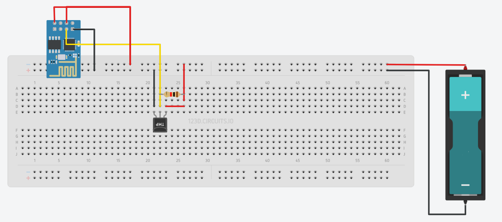

# DeepSleepDS18B20

Proyecto registrador de temperatura ESP8266

### Requerimientos:

 * La última versión del [IDE de Arduino](https://www.arduino.cc/en/Main/Software)
 * La última versión del paquete [ESP8266 package](https://github.com/esp8266/Arduino)
 * Crear el circuito:
   * 
 * Telnet para el reporte de mensajes
   * Para activar telnet en Windows presiona las teclas *WIN+R* y ejecuta el siguiente comando
      ```
      pkgmgr /iu:TelnetClient
      ```
   * Reiniciar
   * Una vez conectada la placa esp8266 a una red wifi utilizar telnet para visualizar los mensajes en consola, por ejemplo:
      ```
        telnet 192.168.0.101
      ```

